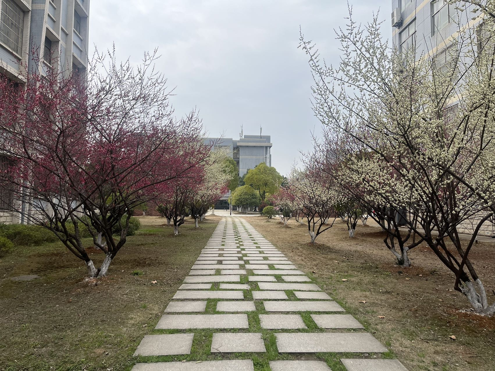
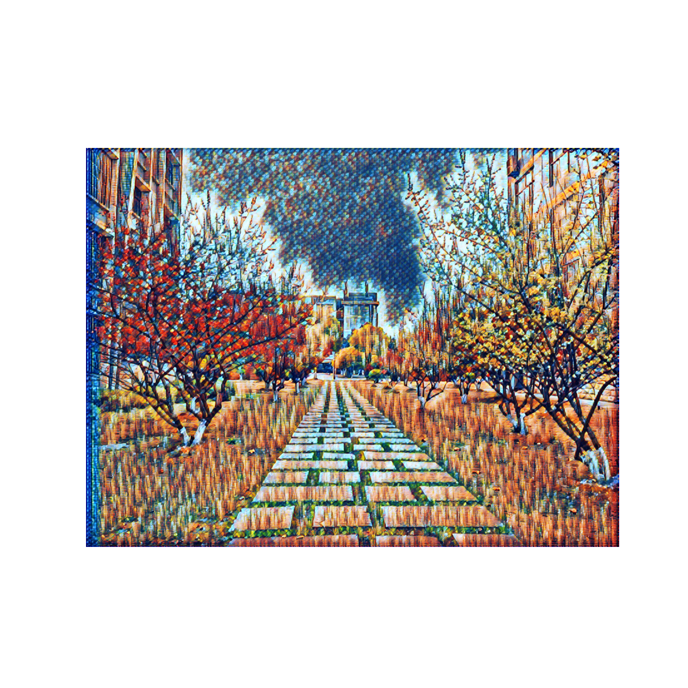

# FastStyleTransfer

FastStyleTransfer models, saved under `scream` directory.  
You can find the style picture in each model directory.  
To load the models, use the `RunStyleNetworks.ipynb` notebook.  

---
## Example (示例)
### Style Image (风格图像)

### Content Image (内容图像)

### Restult (生成结果)

---

[Reference Paper](https://arxiv.org/abs/1603.08155)
